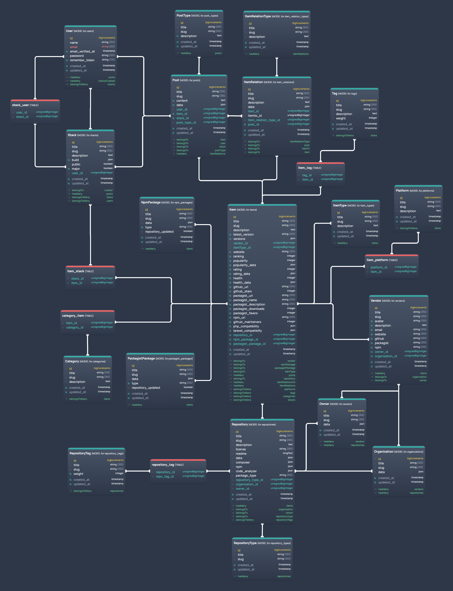

# Laravel Packages

-   Laravel Packages - es gibt keine gute Suche
-   Es muss zuerst mal alle Pakete finden und eine Möglichkeit diese zu kuratieren (Kategorie etc.)
-   Es müssen Updates automatisch erfolgen
-   Es muss User-driven Content geben (Rating, Comments, Discussions)
-   Es sollten nicht nur Packages sein, sondern auch Apps, Tooling etc.
-   News, von überall, auch neue Videos, Training, etc.

-   Viral ...
    -   Show your techstack feature
    -   Share your techstack feature
    -   Vote for your techstack
    -   Donate to your techstacks devs

## Model

## Brand Idee

Nur für Laravel:

-   Larapedia
-   Laraverse
-   Laravault
-   Larafind
-   Explore Laravel
-   Laraworld
-   Discover Laravel
-   Larastack

oder allgemeiner:

-   StackSearch
-   StackBuilder
-   Stackalizer

### Woher Daten?

Im ersten Schritt müsste eine Masse (zwischen 15k und 500k) packages aus Github kommen, dann das Ökosystem und anderes Zeug, damit auch den großen (weitestgehend nutzlosen) Datenbestand qualifizieren.‚

-   Github API (beachte auch alle PHP-Packages, Dependencies)
-   Wettbewerber (initial)
-   Request (Form, sofortige Veröffentlichung aber ungeprüft)
-   eigene Recherche (z. B. von Filament und anderen größeren Laravel-Plattformen)
-   Aus der Codebase (v. a. composer.json und package.json)
-   User-driven, v. a. Rating für Sortierung
-   Blogs (Scraping mit Guzzle und )

### Wettbewerb

-   https://packalyst.com/

### USPs

-   Usability, da fallen alle durch
-   Nicht nur Packages, sondern das ganze Ökosystem
-   Free / Freemium / Paid
-   Suchen für den vorgegebenen Tech-Stack
-   Anbindung an Laravel-News, Laravel Daily, Laravel.io, X, Stackoverflow, Github Issues und Discussions, etc. um für jedes Tool und Package das meiste an aktuellen Infos anzuzeigen

### Todo

-   NPM - https://api-docs.npms.io/ or directly https://stackoverflow.com/questions/34071621/query-npmjs-registry-via-api ... step by step https://www.edoardoscibona.com/exploring-the-npm-registry-api
-   More APIs and maybe some tweaks ... Laracasts, Codecourse, Laravel-Daily, Laravel-News, YT, VS Code Marketplace and many more waiting ...

### Reading from Packagist

-   Packagist API - https://packagist.org/search.json?q=laravel, see https://packagist.org/apidoc oder am besten alles: https://packagist.org/packages/list.json

https://laraverse.test/packagist-search

- [ ] populate the Packagist table, update then
- [ ] create item and all related objects if not exists (packagist url and ID in packagist table), compare and update a bunch of fields then

### Reading from NPM

- [ ] populate the NPM table, update then
- [ ] create item and all related objects if not exists (npm url and ID in npm table), compare and update a bunch of fields then

### Reading from GitHub

https://laraverse.test/github-search/laravel

- [ ] populate the Github table and all related, update then
- [ ] create item and all related objects if not exists (github url and ID in github table), compare and update a bunch of fields then

## Github Data

-   Issues / open / Bugs
-   Discussions?
-   License
-   Tags, Category ...
-   Dependencies PHP / JS - from file

## More Data (to find and calc)

-   Actively Maintained
-   Number of regul. devs
-   Finance
    -   Finance good / OK / poor / unknown
    -   Should be a textual information, too ... company behind or backed by ...
-   Age (first released)
-   Future ... Versions, Roadmap, other?
-   Books ...
-   Videos, Courses (YT, Laracasts, Codecourse, others)
-   Docs (link, per version)
-   Discussions (GH, Stackoverflow, Laravel.io ..., per Version?) and probably an own Forum

## Own Data

-   Likes, Comments, Ratings, Discussions ...
-   Stacks (public)

## Taxonomies

-   Area

    -   Backend Framework
    -   Frontend Framework
    -   Middleware
    -   API Generator
    -   Authentication and User
    -   Deployment Platform
    -   Component Framework
    -   Development Framework
    -   CRUD Generator
    -   Tooling ...
    -   Webserver
    -   Webproxy
    -   Accelerator
    -   Cache
    -   Database
    -   Hosting
    -   Cloud
    -   Code Upgrader
    -   IDE
    -   VCS
    -   Devops ...

-   Type

    -   PHP Package
    -   PHP Skeleton
    -   PHP App
    -   IDE Extension
    -   Windows App
    -   MacOS App
    -   Linux App
    -   PHP Extension
    -   Webserver
    -   Web Platform
    -   Web API
    -   NPM Package
    -   Other Package
    -   Other App
    -   Other

-   Pricing

    -   FOSS - Free Open Source Software.
    -   OSS - Open Source Code but not free.
    -   SaaS - Commercial Software as a Service product.
    -   Libre - Free Software as a Service product.
    -   Shareware - Free but not Open Source Software.
    -   Freemium - Commercial product with a free version.
    -   Commercial - Commercial product with one-time fee or lifetime license.
    -   Subscription - Commercial product with perpetual costs.

-   Features (aka Tags) ... can probably be grouped or aliased
    -   Authentication
    -   Authorization
    -   User management
    -   User profile
    -   User registration
    -   ...

## Handling versions

As a relation or within the main table?

-   Versions are problematic
-   The can change things like license, pricing.
-   The can add features or even change type
-   The can even change name, slug (namespace) ...
-   They change dependencies and everything
-   But they should be clearly just a version ...

## Other ideas

-   Stack-Installer ... is it possible to combine all install commands automagically to an "installer"? Like laravel.build
-   Receipes and compatibility checks (people can check a stack compat)
-   Stack the big picture ... see the stack as a fancy image
-   Safe stack ... how safe (active dev, bottlenecks) is your stack?
-   Books, Video Courses, Learning platforms as new types
-   Packalyst RSS - https://packalyst.com/resources (new and requested)
